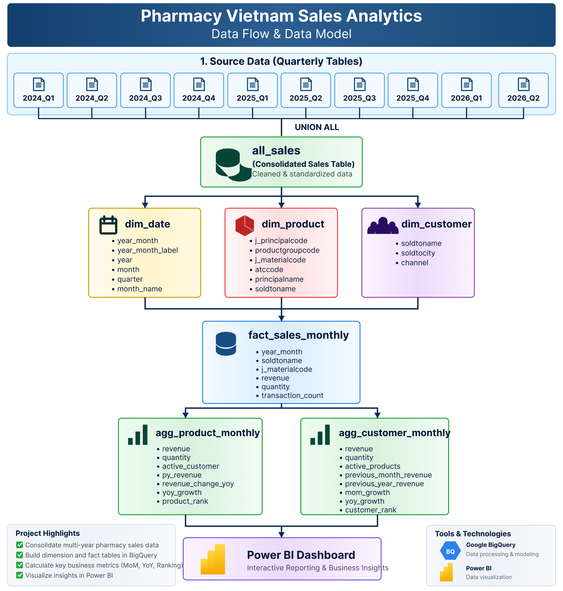

# Pharmacy Vietnam Sales Analytics

End-to-end sales analytics project using BigQuery SQL and Power BI to transform transactional pharmacy data into decision-oriented business insights.

## Project Overview

This project analyzes pharmacy sales performance across multiple years and business dimensions, including products, customers and sales channels.

The workflow covers data consolidation, data modeling, KPI calculation, Power BI visualization and business interpretation.

## Tools & Technologies

- SQL
- Google BigQuery
- Power BI
- DAX
- Power Query

## Data Workflow

Quarterly Source Tables  
↓  
Data Consolidation  
↓  
Dimension & Fact Tables  
↓  
Aggregated Analytical Tables  
↓  
Power BI Dashboard  
↓  
Business Insights

## Data Model



## Dashboard

### 1. Executive Overview


Tracks key indicators including revenue, quantity, YoY growth, YTD revenue, active customers, monthly trends and channel performance.

### 2. Product Performance


Analyzes product-level revenue, quantity, prior-year performance, YoY change and product ranking.

### 3. Customer Performance


Analyzes customer contribution, historical revenue, MoM growth and channel distribution.

## Key Business Insights

### Revenue growth slowed in H1 2026

Revenue increased by approximately **4.8% in 2025 compared with 2024**, while sales quantity increased by only **1.1%**.

This suggests that 2025 growth was more likely supported by pricing effects or a shift toward higher-value products than by volume expansion.

In H1 2026, revenue grew by only **1.2% YoY**, despite quantity increasing by approximately **5.2%**.

### Revenue per reported unit declined

Estimated revenue per reported unit decreased by approximately **3.8% YoY in H1 2026**.

This may indicate stronger discounting, a shift toward lower-priced products or changes in product mix.

### Channel performance became increasingly uneven

Compared with H1 2025:

- Trade: **+68.7%**
- Animal Health: **+25.9%**
- Hospital: **-13.5%**
- Retail: **-2.4%**

Growth is increasingly concentrated in Trade and Animal Health, while Hospital performance is weakening.

### Revenue shows recurring monthly patterns

Revenue in 2025 fluctuated between approximately **VND 3.4T and VND 4.9T per month**, with stronger performance around March, June, August and December.

These peaks may reflect purchasing cycles, tender schedules, promotional activity or inventory replenishment. The pattern should be validated before being treated as confirmed seasonality.

### Product and customer revenue are concentrated

A relatively small group of products and customers contributes a large share of total revenue.

This creates concentration risk and highlights the importance of monitoring major accounts and core products.

## Recommendations

- Investigate the decline in revenue per reported unit.
- Protect high-growth Trade and Animal Health accounts.
- Develop a recovery plan for the Hospital channel.
- Monitor customer and product concentration.
- Separate returns and credit notes from standard sales.
- Compare 2026 using H1-versus-H1 figures instead of full-year comparisons.
- Improve master-data mapping before using Channel and ATC results for management decisions.

## Data Quality & Limitations

Several data-quality issues were identified:

- **29,094 records** contain missing quantity or revenue information.
- Negative revenue values may represent returns, credit notes or data errors.
- Customer names contain inconsistent spacing and encoding.
- Placeholder customer values such as `ZZZCCC` are present.
- 2026 contains partial-year data, including an incomplete July period.

These limitations may affect customer counts, channel attribution, product totals and YoY comparisons.

## Project Structure

```text
pharmacy-vietnam-sales-analytics/
│
├── README.md
├── sql/
│   ├── 01_build_base_table.sql
│   ├── 02_dim_date.sql
│   ├── 03_dim_product.sql
│   ├── 04_dim_customer.sql
│   ├── 05_fact_sales_monthly.sql
│   ├── 06_agg_product_monthly.sql
│   └── 07_agg_customer_monthly.sql
│
├── images/
│   ├── executive_overview.png
│   ├── product_performance.png
│   └── customer_performance.png
│
├── docs/
│   └── data_model.png
│
└── powerbi/
    └── README.md
