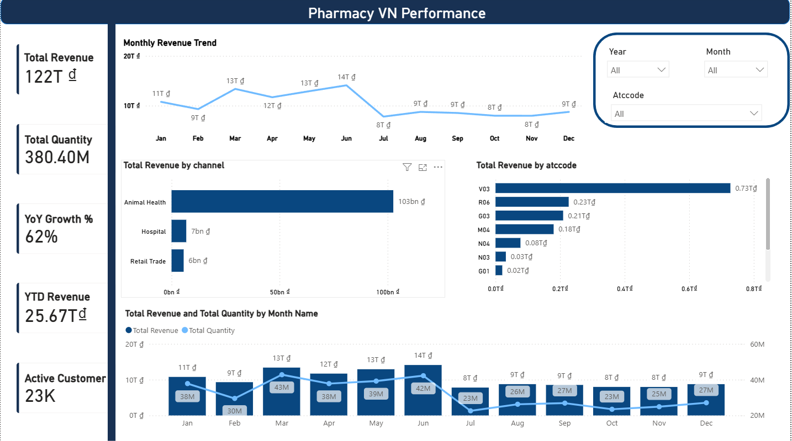
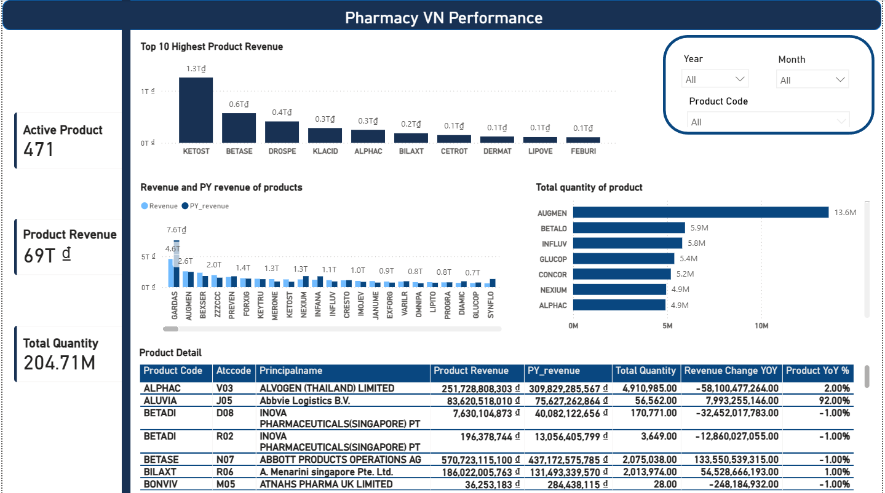
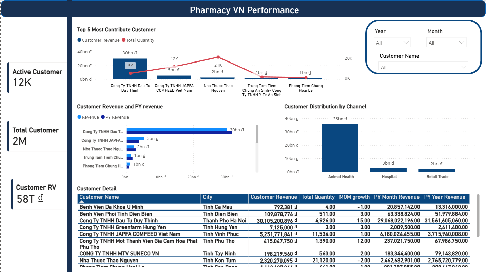

# Pharmacy Vietnam Sales Analytics

Dự án phân tích dữ liệu bán hàng ngành dược tại Việt Nam, được xây dựng theo quy trình từ xử lý dữ liệu bằng SQL trên BigQuery đến trực quan hóa và phân tích trên Power BI.

Mục tiêu của dự án là theo dõi hiệu suất kinh doanh theo thời gian, sản phẩm, khách hàng và kênh bán hàng, từ đó hỗ trợ đánh giá biến động doanh thu và hiệu quả hoạt động.

## Công nghệ sử dụng

- SQL
- BigQuery
- Power BI
- DAX
- Power Query

## Quy trình thực hiện

Raw Data  
↓  
SQL Cleaning & Transformation  
↓  
Aggregated Tables  
↓  
Power BI Data Model  
↓  
Dashboard & Business Analysis

## Dashboard

### 1. Executive Overview



Trang tổng quan theo dõi các chỉ số chính như doanh thu, sản lượng, tăng trưởng theo năm, doanh thu lũy kế và số lượng khách hàng hoạt động.

### 2. Product Performance



Phân tích hiệu suất sản phẩm dựa trên doanh thu, sản lượng, doanh thu kỳ trước, mức thay đổi theo năm và xếp hạng sản phẩm.

### 3. Customer Performance



Phân tích hiệu suất khách hàng dựa trên doanh thu, sản lượng, mức đóng góp, tăng trưởng theo tháng và doanh thu của các kỳ trước.

## Cấu trúc dự án

```text
pharmacy-vietnam-sales-analytics/
│
├── README.md
├── sql/
├── powerbi/
│   └── README.md
├── images/
│   ├── executive_overview.png
│   ├── product_performance.png
│   └── customer_performance.png
└── docs/
